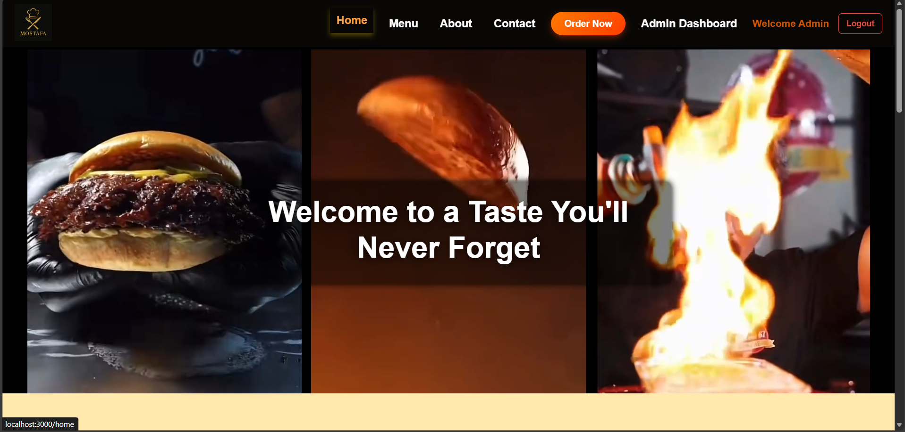
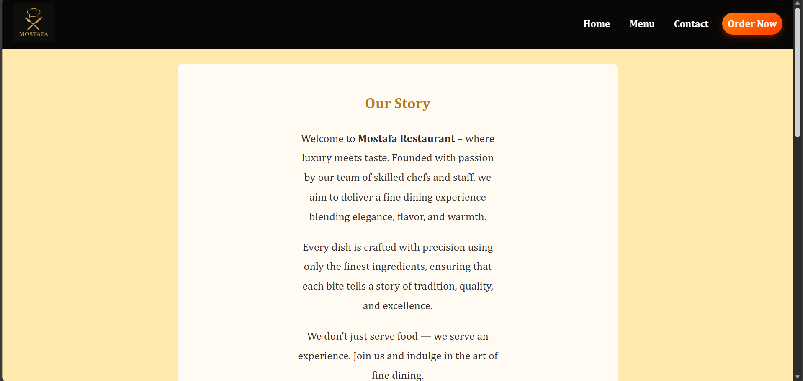
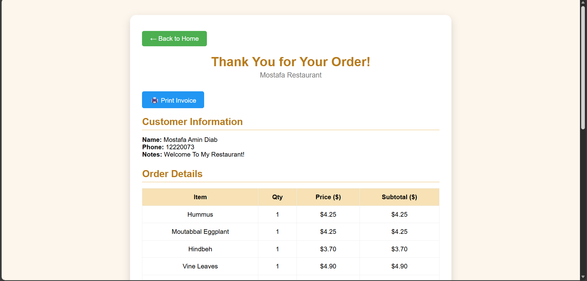

# Restaurant Ordering System 👋

[](#)

> Frontend built with ReactJS for browsing menu, placing orders, and viewing restaurant info.

---

## Project Info

- **Version:** 1.0.0  
- **Project homepage:** *(not provided)*  
- **Project demo URL:** *(not provided)*  
- **Project documentation URL:** *(not provided)*  
- **Author name:** Mostafa Diab  
- **GitHub username:** *(not provided)*  
- **Author website:** *(not provided)*  
- **Twitter username:** *(not provided)*  
- **LinkedIn username:** *(not provided)*  
- **Patreon username:** *(not provided)*  
- **License:** ISC  
- **Install command:** `npm install`  
- **Usage command:** `npm start`  
- **Test command:** *(not provided)*  

---

## Features
- Responsive design (desktop & mobile)  
- Dynamic menu fetching from backend  
- Cart and order submission  
- Smooth scroll to Contact section  
- Admin dashboard (optional)  

---

## Pages
- Home  
- Menu (dynamic categories & items)  
- About  
- Contact  
- Order  
- Admin (for admin users)  
- Login  

---

## Frontend Setup

1. Navigate to frontend folder:

```bash
cd frontend
npm install
npm start

## Screenshots









